# Polyglot Codebase Knowledge Graph

> Generated offline by **readmenator**. Supports C, C++, Python, Go, Rust, JS/TS, Java, C#, Shell, PHP, Dart, GDScript, Nim, ASM, Ruby, Swift, Kotlin, Scala, Lua, Elixir.
> No LLMs. No tokens. Pure static analysis. See more [here](https://github.com/grisuno/ReadMenator)

**Total Files Parsed:** 4 | **Total Symbols Extracted:** 69 | **Total Imports:** 24

<!-- ranking_model: v1.0 | weights: {ppr:0.45,auth:0.2,test:0.15,doc:0.1,fresh:0.1} | alpha:0.85 | commit:e63a2e6 | date:2026-07-18 -->


## Table of Contents

1. [Statistics Dashboard](#statistics-dashboard)
2. [Architectural Layers](#architectural-layers)
3. [Ranked Context](#ranked-context)
4. [God Nodes](#god-nodes)
5. [Suggested Questions](#suggested-questions)
6. [Taint Propagation Map](#taint-propagation-map)
7. [Hotspot Analysis](#hotspot-analysis)
8. [Change Impact Analysis](#change-impact-analysis)
9. [Suggested Linting Rules](#suggested-linting-rules)
10. [Query Recipes](#query-recipes)
11. [Structural Knowledge Map](#structural-knowledge-map)
12. [Code Property Graph](#code-property-graph)
13. [Architecture Reference](#architecture-reference)
    - [C (1 files)](#c-1-files)
    - [PY (1 files)](#py-1-files)
    - [SH (2 files)](#sh-2-files)

---

## Statistics Dashboard

| Metric | Value |
|--------|-------|
| Total Files | 4 |
| Total Symbols | 69 |
| Total Imports | 24 |
| Call Edges | 149 |
| Inheritance Edges | 0 |
| Languages | 3 |
| Avg Symbols/File | 17.2 |
| Avg Imports/File | 6.0 |

### Top Files by Import Count (Fan-Out)

| File | Imports | Symbols | Language |
|------|---------|---------|----------|
| `keylogger.c` | 16 | 29 | c |
| `app.py` | 8 | 26 | py |

---

## Architectural Layers

Auto-detected from path patterns, naming conventions, and imported frameworks.

| Layer | Files |
|-------|-------|
| utility | 2 |
| infrastructure | 2 |

### utility

- `app.py` (py, 26 symbols)
- `install.sh` (sh, 7 symbols)

### infrastructure

- `configure.sh` (sh, 7 symbols)
- `keylogger.c` (c, 29 symbols)

---

## Ranked Context

Files ranked by composite score for the current query context. The ranking combines Personalized PageRank (query relevance), global authority, test coverage, documentation coverage, and code freshness. Model: v1.0.

| Rank | File | Composite | PPR | Authority | Test | Doc |
|------|------|-----------|-----|-----------|------|-----|
| 1 | `configure.sh` | 0.0714 | 0.0000 | 0.0000 | 0.00 | 0.71 |
| 2 | `install.sh` | 0.0714 | 0.0000 | 0.0000 | 0.00 | 0.71 |
| 3 | `keylogger.c` | 0.0621 | 0.0000 | 0.0000 | 0.00 | 0.62 |
| 4 | `app.py` | 0.0538 | 0.0000 | 0.0000 | 0.00 | 0.54 |

---

## God Nodes

Most architecturally central files ranked by combined import/export degree and symbol richness.

| File | Score | Connections | PageRank |
|------|-------|-------------|----------|
| `keylogger.c` | 2.9 | | 0.0000 |
| `app.py` | 2.6 | | 0.0000 |
| `configure.sh` | 0.7 | | 0.0000 |
| `install.sh` | 0.7 | | 0.0000 |

---

## Suggested Questions

Auto-generated exploration prompts based on graph structure:

- What does keylogger.c depend on, and what depends on it? (0 connections)
- What does app.py depend on, and what depends on it? (0 connections)
- What does configure.sh depend on, and what depends on it? (0 connections)
- What is Colours in app.py and how is it used?
- What is the overall architecture of this codebase?

---

## Taint Propagation Map

Taint analysis traces how dangerous imports propagate through the codebase via transitive dependencies. Source files import dangerous modules directly; sink files receive the danger indirectly.

**Taint Sources:** 2 | **Taint Sinks:** 2 | **Propagation Paths:** 3

- `app.py` imports `subprocess` (0 hop to `app.py`) [high]
  Path: app.py
- `keylogger.c` imports `input` (0 hop to `keylogger.c`) [medium]
  Path: keylogger.c
- `keylogger.c` imports `input` (0 hop to `keylogger.c`) [medium]
  Path: keylogger.c

---

## Hotspot Analysis

Files ranked by combined complexity (symbol count) and centrality (connection count). High-scoring files are architecturally critical and may need refactoring attention.

| File | Complexity | Centrality | Combined | Symbols | Connections |
|------|-----------|------------|----------|---------|-------------|
| `configure.sh` | 0.241 | 0.000 | 0.097 | 7 | 0 |
| `install.sh` | 0.241 | 0.000 | 0.097 | 7 | 0 |
| `keylogger.c` | 1.000 | 1.000 | 1.000 | 29 | 16 |
| `app.py` | 0.897 | 0.500 | 0.659 | 26 | 8 |

---

## Change Impact Analysis

Files sorted by how many other files would be affected if they changed. High-impact files should be changed with caution.

| File | Direct Dependents | Transitive Dependents | Total Impact |
|------|------------------|----------------------|--------------|
| `app.py` | 0 | 0 | 0 |
| `configure.sh` | 0 | 0 | 0 |
| `install.sh` | 0 | 0 | 0 |
| `keylogger.c` | 0 | 0 | 0 |

---

## Suggested Linting Rules

Automatically suggested linting and security rules based on patterns detected in the codebase. These can be exported as Semgrep rules using the `--export-rules` flag.

| Rule ID | Severity | Description | Language | Matches |
|---------|----------|-------------|----------|---------|
| `RM001` | info | Large number of functions in py: 24 total | py | 24 |
| `RM002` | info | Large number of functions in sh: 14 total | sh | 14 |
| `RM003` | info | Large number of functions in c: 18 total | c | 18 |
| `RM004` | info | Print statement found (consider logging instead) | python | 15 |

---

## Query Recipes

Example queries you can run against this knowledge base using the ranking engine:

```
# Find files most relevant to a concept
readmenator query "Where is the import resolver implemented?"

# Rank files by relevance to a topic
readmenator query "How does documentation generation work?"

# Explain why a file ranks highly
readmenator query "explain readmenator/_documentation.py"

# Trace dependency paths with ranked context
readmenator query "path from CLI to exporter"
```

The ranking model uses the following signals:

- **Personalized PageRank** (45% weight): query-specific relevance via seed propagation
- **Global Authority** (20% weight): structural importance via standard PageRank
- **Test Coverage** (15% weight): fraction of symbols referenced in test files
- **Doc Coverage** (10% weight): presence of docstrings and file-level docs
- **Freshness** (10% weight): recent modification activity

Results include score decomposition and justification paths for each ranked item.

---

## Structural Knowledge Map

```mermaid
graph TD
    classDef mod fill:#1e1e1e,stroke:#ff6666,stroke-width:2px,color:#fff;
    classDef cls fill:#2d2d2d,stroke:#4ec9b0,stroke-width:2px,color:#fff;
    classDef fn fill:#333,stroke:#dcdcaa,stroke-width:1px,color:#dcdcaa;
    classDef ext fill:#111,stroke:#666,stroke-dasharray:5 5,color:#aaa;
    keylogger_c["keylogger.c (c)"]
    class keylogger_c mod;
    keylogger_c_signal_handler["signal_handler"]
    class keylogger_c_signal_handler fn;
    keylogger_c --> keylogger_c_signal_handler
    keylogger_c_shift_symbol["shift_symbol"]
    class keylogger_c_shift_symbol fn;
    keylogger_c --> keylogger_c_shift_symbol
    keylogger_c_update_modifiers["update_modifiers"]
    class keylogger_c_update_modifiers fn;
    keylogger_c --> keylogger_c_update_modifiers
    keylogger_c_key_to_string["key_to_string"]
    class keylogger_c_key_to_string fn;
    keylogger_c --> keylogger_c_key_to_string
    keylogger_c_write_log["write_log"]
    class keylogger_c_write_log fn;
    keylogger_c --> keylogger_c_write_log
    app_py["app.py (py)"]
    class app_py mod;
    configure_sh["configure.sh (sh)"]
    class configure_sh mod;
    install_sh["install.sh (sh)"]
    class install_sh mod;
    ext_os["os"]
    class ext_os ext;
    app_py -.->|imports| ext_os
    ext_sys["sys"]
    class ext_sys ext;
    app_py -.->|imports| ext_sys
    ext_subprocess["subprocess"]
    class ext_subprocess ext;
    app_py -.->|imports| ext_subprocess
    ext_shutil["shutil"]
    class ext_shutil ext;
    app_py -.->|imports| ext_shutil
    ext_time["time"]
    class ext_time ext;
    app_py -.->|imports| ext_time
    ext_argparse["argparse"]
    class ext_argparse ext;
    app_py -.->|imports| ext_argparse
    ext_signal["signal"]
    class ext_signal ext;
    app_py -.->|imports| ext_signal
    ext_pathlib["pathlib"]
    class ext_pathlib ext;
    app_py -.->|imports| ext_pathlib
    ext_stdio_h["stdio.h"]
    class ext_stdio_h ext;
    keylogger_c -.->|imports| ext_stdio_h
    ext_stdlib_h["stdlib.h"]
    class ext_stdlib_h ext;
    keylogger_c -.->|imports| ext_stdlib_h
    ext_string_h["string.h"]
    class ext_string_h ext;
    keylogger_c -.->|imports| ext_string_h
    ext_unistd_h["unistd.h"]
    class ext_unistd_h ext;
    keylogger_c -.->|imports| ext_unistd_h
    ext_fcntl_h["fcntl.h"]
    class ext_fcntl_h ext;
    keylogger_c -.->|imports| ext_fcntl_h
    ext_errno_h["errno.h"]
    class ext_errno_h ext;
    keylogger_c -.->|imports| ext_errno_h
    ext_signal_h["signal.h"]
    class ext_signal_h ext;
    keylogger_c -.->|imports| ext_signal_h
    ext_time_h["time.h"]
    class ext_time_h ext;
    keylogger_c -.->|imports| ext_time_h
    ext_poll_h["poll.h"]
    class ext_poll_h ext;
    keylogger_c -.->|imports| ext_poll_h
    ext_sys_ioctl_h["ioctl.h"]
    class ext_sys_ioctl_h ext;
    keylogger_c -.->|imports| ext_sys_ioctl_h
    ext_sys_stat_h["stat.h"]
    class ext_sys_stat_h ext;
    keylogger_c -.->|imports| ext_sys_stat_h
    ext_sys_types_h["types.h"]
    class ext_sys_types_h ext;
    keylogger_c -.->|imports| ext_sys_types_h
    ext_sys_inotify_h["inotify.h"]
    class ext_sys_inotify_h ext;
    keylogger_c -.->|imports| ext_sys_inotify_h
    ext_linux_input_h["input.h"]
    class ext_linux_input_h ext;
    keylogger_c -.->|imports| ext_linux_input_h
    ext_linux_input_event_codes_h["input-event-codes.h"]
    class ext_linux_input_event_codes_h ext;
    keylogger_c -.->|imports| ext_linux_input_event_codes_h
    ext_limits_h["limits.h"]
    class ext_limits_h ext;
    keylogger_c -.->|imports| ext_limits_h
```



---

## Code Property Graph

Machine-readable Code Property Graph (CPG) in JSON-LD format. This block allows AI agents to parse the full structural graph without additional file reads. Compatible with GraphRAG pipelines.

```json
{"@context": "https://readmenator.dev/cpg/v1", "analysis": {"communities": [], "god_nodes": [{"node_id": "keylogger.c", "score": 2.9}, {"node_id": "app.py", "score": 2.6}, {"node_id": "configure.sh", "score": 0.7}, {"node_id": "install.sh", "score": 0.7}], "surprising_connections": []}, "edges": [{"confidence": "EXTRACTED", "relation": "imports", "source": "app.py", "target": "os"}, {"confidence": "EXTRACTED", "relation": "imports", "source": "app.py", "target": "sys"}, {"confidence": "EXTRACTED", "relation": "imports", "source": "app.py", "target": "subprocess"}, {"confidence": "EXTRACTED", "relation": "imports", "source": "app.py", "target": "shutil"}, {"confidence": "EXTRACTED", "relation": "imports", "source": "app.py", "target": "time"}, {"confidence": "EXTRACTED", "relation": "imports", "source": "app.py", "target": "argparse"}, {"confidence": "EXTRACTED", "relation": "imports", "source": "app.py", "target": "signal"}, {"confidence": "EXTRACTED", "relation": "imports", "source": "app.py", "target": "pathlib"}, {"confidence": "EXTRACTED", "relation": "imports", "source": "keylogger.c", "target": "stdio.h"}, {"confidence": "EXTRACTED", "relation": "imports", "source": "keylogger.c", "target": "stdlib.h"}, {"confidence": "EXTRACTED", "relation": "imports", "source": "keylogger.c", "target": "string.h"}, {"confidence": "EXTRACTED", "relation": "imports", "source": "keylogger.c", "target": "unistd.h"}, {"confidence": "EXTRACTED", "relation": "imports", "source": "keylogger.c", "target": "fcntl.h"}, {"confidence": "EXTRACTED", "relation": "imports", "source": "keylogger.c", "target": "errno.h"}, {"confidence": "EXTRACTED", "relation": "imports", "source": "keylogger.c", "target": "signal.h"}, {"confidence": "EXTRACTED", "relation": "imports", "source": "keylogger.c", "target": "time.h"}, {"confidence": "EXTRACTED", "relation": "imports", "source": "keylogger.c", "target": "poll.h"}, {"confidence": "EXTRACTED", "relation": "imports", "source": "keylogger.c", "target": "sys/ioctl.h"}, {"confidence": "EXTRACTED", "relation": "imports", "source": "keylogger.c", "target": "sys/stat.h"}, {"confidence": "EXTRACTED", "relation": "imports", "source": "keylogger.c", "target": "sys/types.h"}, {"confidence": "EXTRACTED", "relation": "imports", "source": "keylogger.c", "target": "sys/inotify.h"}, {"confidence": "EXTRACTED", "relation": "imports", "source": "keylogger.c", "target": "linux/input.h"}, {"confidence": "EXTRACTED", "relation": "imports", "source": "keylogger.c", "target": "linux/input-event-codes.h"}, {"confidence": "EXTRACTED", "relation": "imports", "source": "keylogger.c", "target": "limits.h"}], "generator": "readmenator", "metadata": {"edge_count": 173, "file_count": 4, "language_count": 3, "symbol_count": 69}, "nodes": [{"doc": "_*_ coding: utf8 _*_ ------------------------------------------------------------------------------ keylogger_orchestrator.py - Orchestration script for the Linux keylogger (evdev-based) project.  This script manages the entire lifecycle: - Prerequisite installation (via install.sh) - Environment verification (via configure) - Compilation (make) - Installation (make install) - Runtime control (start, stop, status, read logs)  Usage: python3 app.py [command]  Commands: setup      - Run install.sh and configure (full preparation) build      - Compile the keylogger (make) install    - Install the binary system-wide (make install) start      - Start the keylogger daemon (make run) stop       - Stop the daemon (make stop) status     - Show daemon status (make status) read       - Show the log (make read) clean      - Clean build artifacts (make clean) all        - Run setup, build, and install (full chain) menu       - Interactive menu (default if no command given) help       - Show this help ------------------------------------------------------------------------------", "id": "app.py", "kind": "module", "label": "app.py", "language": "py", "sha256": "747a32e66af69fec", "symbol_count": 26, "symbols": [{"kind": "class", "line": 43, "name": "Colours", "signature": "class Colours"}, {"kind": "method", "line": 53, "name": "info", "signature": "def info(msg)"}, {"kind": "method", "line": 54, "name": "ok", "signature": "def ok(msg)"}, {"kind": "method", "line": 55, "name": "warn", "signature": "def warn(msg)"}, {"kind": "method", "line": 56, "name": "error", "signature": "def error(msg)"}, {"doc": "Run a shell command and return its output/status.", "kind": "method", "line": 61, "name": "run_command", "signature": "def run_command(cmd, cwd, check, capture)"}, {"kind": "method", "line": 81, "name": "file_exists", "signature": "def file_exists(path)"}, {"kind": "method", "line": 84, "name": "dir_exists", "signature": "def dir_exists(path)"}, {"kind": "method", "line": 87, "name": "require_file", "signature": "def require_file(path, description)"}, {"kind": "method", "line": 92, "name": "require_dir", "signature": "def require_dir(path, description)"}, {"doc": "Check if sudo is available and the user can run it.", "kind": "method", "line": 97, "name": "check_sudo", "signature": "def check_sudo()"}, {"kind": "class", "line": 112, "name": "Orchestrator", "signature": "class Orchestrator"}, {"doc": "Show a text-based menu and loop until exit.", "kind": "method", "line": 231, "name": "interactive_menu", "signature": "def interactive_menu(orch)"}, {"kind": "method", "line": 278, "name": "parse_args", "signature": "def parse_args()"}, {"kind": "method", "line": 306, "name": "main", "signature": "def main()"}, {"kind": "method", "line": 113, "name": "__init__", "signature": "def __init__(self, base_dir)"}, {"doc": "Verify that all expected files exist.", "kind": "method", "line": 123, "name": "check_prerequisites", "signature": "def check_prerequisites(self)"}, {"doc": "Run install.sh and configure.", "kind": "method", "line": 135, "name": "setup", "signature": "def setup(self)"}, {"doc": "Compile the keylogger using make.", "kind": "method", "line": 159, "name": "build", "signature": "def build(self)"}, {"doc": "Run make install (requires sudo).", "kind": "method", "line": 172, "name": "install", "signature": "def install(self)"}, {"doc": "Start the daemon (make run).", "kind": "method", "line": 186, "name": "start", "signature": "def start(self)"}, {"doc": "Stop the daemon (make stop).", "kind": "method", "line": 196, "name": "stop", "signature": "def stop(self)"}, {"doc": "Show status (make status).", "kind": "method", "line": 202, "name": "status", "signature": "def status(self)"}, {"doc": "Show log (make read).", "kind": "method", "line": 207, "name": "read_log", "signature": "def read_log(self, lines)"}, {"doc": "Clean build artifacts (make clean).", "kind": "method", "line": 214, "name": "clean", "signature": "def clean(self)"}, {"doc": "Run setup, build, install.", "kind": "method", "line": 220, "name": "full_chain", "signature": "def full_chain(self)"}]}, {"doc": "configure - Environment verification script for the Linux keylogger (evdev-based) project.  Usage: ./configure [--prefix=PREFIX] [--help]  Checks: - C compiler (gcc or cc) - make utility - Standard C library headers (stdio.h, stdlib.h, etc.) - Linux input header <linux/input.h> and <linux/input-event-codes.h> - /dev/input directory and at least one event device - Current user's ability to read /dev/input/event* (root or input group) - That the source file keylogger.c exists  Generates config.mk with: - CC, CFLAGS, LDFLAGS - HAVE_INPUT_HEADER (yes/no) - NEED_SUDO (yes/no) based on group membership - INSTALL_PREFIX - LOG_FILE location (can be overridden)  This script is idempotent and can be re-run to update configuration.  -----------------------------------------------------------------------------", "id": "configure.sh", "kind": "module", "label": "configure.sh", "language": "sh", "sha256": "866589517a6080c2", "symbol_count": 7, "symbols": [{"doc": "---------------------------------------------------------------------------- Helper functions -----------------------------------------------------------------------------", "kind": "function", "line": 53, "name": "msg_info"}, {"kind": "function", "line": 54, "name": "msg_ok"}, {"kind": "function", "line": 55, "name": "msg_warn"}, {"kind": "function", "line": 56, "name": "msg_error"}, {"doc": "Check if a command exists", "kind": "function", "line": 59, "name": "command_exists"}, {"doc": "Check if a C header exists by trying to compile a tiny program", "kind": "function", "line": 64, "name": "check_header"}, {"doc": "Check if we can read a device file (by opening it)", "kind": "function", "line": 71, "name": "can_read_device"}]}, {"doc": "============================================================================= install.sh - Prerequisite installer for the Linux keylogger project ============================================================================= This script detects the Linux distribution, installs the required build tools (gcc, make, libc development headers), and adds the current user to the 'input' group so that /dev/input/event* can be accessed without root. It also verifies that the kernel supports evdev and that the required directories exist. Optionally, it compiles the keylogger after installation. =============================================================================", "id": "install.sh", "kind": "module", "label": "install.sh", "language": "sh", "sha256": "ab2ca351513d084b", "symbol_count": 7, "symbols": [{"doc": "---------------------------------------------------------------------------- Helper functions -----------------------------------------------------------------------------", "kind": "function", "line": 25, "name": "info"}, {"kind": "function", "line": 26, "name": "ok"}, {"kind": "function", "line": 27, "name": "warn"}, {"kind": "function", "line": 28, "name": "error"}, {"doc": "Check if we are running as root (or with sudo)", "kind": "function", "line": 31, "name": "check_root"}, {"doc": "Detect the package manager and install packages", "kind": "function", "line": 38, "name": "install_packages"}, {"doc": "---------------------------------------------------------------------------- Main installation routine -----------------------------------------------------------------------------", "kind": "function", "line": 67, "name": "main"}]}, {"id": "keylogger.c", "kind": "module", "label": "keylogger.c", "language": "c", "sha256": "82fd0d14d7254dfe", "symbol_count": 29, "symbols": [{"doc": "-------------------------------------------------------------------------- Signal handler ---------------------------------------------------------------------------", "kind": "function", "line": 77, "name": "signal_handler", "signature": "static void signal_handler(int sig)"}, {"doc": "-------------------------------------------------------------------------- Shift-symbol mapping for US QWERTY ---------------------------------------------------------------------------", "kind": "function", "line": 168, "name": "shift_symbol", "signature": "static const char *shift_symbol(unsigned int code)"}, {"doc": "-------------------------------------------------------------------------- Modifier updates ---------------------------------------------------------------------------", "kind": "function", "line": 198, "name": "update_modifiers", "signature": "static void update_modifiers(unsigned int code, int value)"}, {"doc": "-------------------------------------------------------------------------- Key code to string conversion (thread-safe, uses caller buffer) Returns string length or 0 if no output should be logged ---------------------------------------------------------------------------", "kind": "function", "line": 212, "name": "key_to_string", "signature": "static int key_to_string(unsigned int code, int value, char *out, size_t out_size)"}, {"doc": "-------------------------------------------------------------------------- Write a string to the log file (and stderr if in foreground with debug) ---------------------------------------------------------------------------", "kind": "function", "line": 271, "name": "write_log", "signature": "static void write_log(const char *str)"}, {"doc": "-------------------------------------------------------------------------- Check if a device is a keyboard via ioctl ---------------------------------------------------------------------------", "kind": "function", "line": 298, "name": "is_keyboard_device", "signature": "static int is_keyboard_device(int fd)"}, {"doc": "-------------------------------------------------------------------------- Try to open a keyboard by event device index ---------------------------------------------------------------------------", "kind": "function", "line": 314, "name": "open_keyboard_by_index", "signature": "static int open_keyboard_by_index(int idx)"}, {"doc": "-------------------------------------------------------------------------- Scan all /dev/input/event* and return keyboard fds ---------------------------------------------------------------------------", "kind": "function", "line": 329, "name": "scan_keyboards", "signature": "static int scan_keyboards(int *fds, int max_count)"}, {"doc": "-------------------------------------------------------------------------- Close all keyboard file descriptors ---------------------------------------------------------------------------", "kind": "function", "line": 345, "name": "close_keyboards", "signature": "static void close_keyboards(int *fds, int count)"}, {"doc": "-------------------------------------------------------------------------- Parse a single config line (key = value) ---------------------------------------------------------------------------", "kind": "function", "line": 354, "name": "parse_config_line", "signature": "static void parse_config_line(const char *line)"}, {"doc": "-------------------------------------------------------------------------- Load configuration from a file ---------------------------------------------------------------------------", "kind": "function", "line": 405, "name": "load_config", "signature": "static void load_config(const char *path)"}, {"doc": "-------------------------------------------------------------------------- Initialize configuration from all known sources ---------------------------------------------------------------------------", "kind": "function", "line": 420, "name": "init_config", "signature": "static void init_config()"}, {"doc": "-------------------------------------------------------------------------- Print usage ---------------------------------------------------------------------------", "kind": "function", "line": 433, "name": "print_usage", "signature": "static void print_usage(const char *prog)"}, {"doc": "-------------------------------------------------------------------------- Process event from a keyboard device ---------------------------------------------------------------------------", "kind": "function", "line": 444, "name": "process_event", "signature": "static void process_event(struct input_event *ev)"}, {"doc": "-------------------------------------------------------------------------- Handle inotify event (new/removed devices in /dev/input) ---------------------------------------------------------------------------", "kind": "function", "line": 456, "name": "handle_inotify", "signature": "static int handle_inotify(int inotify_fd, int *fds, int *count)"}, {"doc": "-------------------------------------------------------------------------- Main keylogger loop ---------------------------------------------------------------------------", "kind": "function", "line": 477, "name": "run_keylogger", "signature": "static void run_keylogger()"}, {"doc": "-------------------------------------------------------------------------- Daemonize (fork, detach from terminal) ---------------------------------------------------------------------------", "kind": "function", "line": 589, "name": "daemonize", "signature": "static void daemonize()"}, {"doc": "-------------------------------------------------------------------------- Main ---------------------------------------------------------------------------", "kind": "function", "line": 625, "name": "main", "signature": "int main(int argc, char *argv[])"}, {"kind": "macro", "line": 13, "name": "_GNU_SOURCE"}, {"kind": "macro", "line": 35, "name": "LOG_FILE_DEFAULT"}, {"kind": "macro", "line": 36, "name": "PID_FILE"}, {"kind": "macro", "line": 37, "name": "CONF_FILE_SYSTEM"}, {"kind": "macro", "line": 38, "name": "CONF_FILE_USER"}, {"kind": "macro", "line": 39, "name": "POLL_TIMEOUT_MS"}, {"kind": "macro", "line": 40, "name": "MAX_KEYBOARDS"}, {"kind": "macro", "line": 41, "name": "KEY_MAP_SIZE"}, {"kind": "macro", "line": 42, "name": "CONF_LINE_MAX"}, {"kind": "macro", "line": 43, "name": "EVENT_BUF_LEN"}, {"kind": "macro", "line": 44, "name": "INOTIFY_BUF_LEN"}]}], "type": "CodePropertyGraph", "version": "1.0"}
```

---

## Architecture Reference

### C (1 files)

#### `keylogger.c`
**Path:** `keylogger.c`

**Functions:**
- `signal_handler` (line 77) `static void signal_handler(int sig)` - *-------------------------------------------------------------------------- Signal handler ---------------------------------------------------------------------------*
- `shift_symbol` (line 168) `static const char *shift_symbol(unsigned int code)` - *-------------------------------------------------------------------------- Shift-symbol mapping for US QWERTY ---------------------------------------------------------------------------*
- `update_modifiers` (line 198) `static void update_modifiers(unsigned int code, int value)` - *-------------------------------------------------------------------------- Modifier updates ---------------------------------------------------------------------------*
- `key_to_string` (line 212) `static int key_to_string(unsigned int code, int value, char *out, size_t out_size)` - *-------------------------------------------------------------------------- Key code to string conversion (thread-safe, uses caller buffer) Returns string length or 0 if no output should be logged ---------------------------------------------------------------------------*
- `write_log` (line 271) `static void write_log(const char *str)` - *-------------------------------------------------------------------------- Write a string to the log file (and stderr if in foreground with debug) ---------------------------------------------------------------------------*
- `is_keyboard_device` (line 298) `static int is_keyboard_device(int fd)` - *-------------------------------------------------------------------------- Check if a device is a keyboard via ioctl ---------------------------------------------------------------------------*
- `open_keyboard_by_index` (line 314) `static int open_keyboard_by_index(int idx)` - *-------------------------------------------------------------------------- Try to open a keyboard by event device index ---------------------------------------------------------------------------*
- `scan_keyboards` (line 329) `static int scan_keyboards(int *fds, int max_count)` - *-------------------------------------------------------------------------- Scan all /dev/input/event* and return keyboard fds ---------------------------------------------------------------------------*
- `close_keyboards` (line 345) `static void close_keyboards(int *fds, int count)` - *-------------------------------------------------------------------------- Close all keyboard file descriptors ---------------------------------------------------------------------------*
- `parse_config_line` (line 354) `static void parse_config_line(const char *line)` - *-------------------------------------------------------------------------- Parse a single config line (key = value) ---------------------------------------------------------------------------*
- `load_config` (line 405) `static void load_config(const char *path)` - *-------------------------------------------------------------------------- Load configuration from a file ---------------------------------------------------------------------------*
- `init_config` (line 420) `static void init_config()` - *-------------------------------------------------------------------------- Initialize configuration from all known sources ---------------------------------------------------------------------------*
- `print_usage` (line 433) `static void print_usage(const char *prog)` - *-------------------------------------------------------------------------- Print usage ---------------------------------------------------------------------------*
- `process_event` (line 444) `static void process_event(struct input_event *ev)` - *-------------------------------------------------------------------------- Process event from a keyboard device ---------------------------------------------------------------------------*
- `handle_inotify` (line 456) `static int handle_inotify(int inotify_fd, int *fds, int *count)` - *-------------------------------------------------------------------------- Handle inotify event (new/removed devices in /dev/input) ---------------------------------------------------------------------------*
- `run_keylogger` (line 477) `static void run_keylogger()` - *-------------------------------------------------------------------------- Main keylogger loop ---------------------------------------------------------------------------*
- `daemonize` (line 589) `static void daemonize()` - *-------------------------------------------------------------------------- Daemonize (fork, detach from terminal) ---------------------------------------------------------------------------*
- `main` (line 625) `int main(int argc, char *argv[])` - *-------------------------------------------------------------------------- Main ---------------------------------------------------------------------------*

**Macros:**
- `_GNU_SOURCE` (line 13)
- `LOG_FILE_DEFAULT` (line 35)
- `PID_FILE` (line 36)
- `CONF_FILE_SYSTEM` (line 37)
- `CONF_FILE_USER` (line 38)
- `POLL_TIMEOUT_MS` (line 39)
- `MAX_KEYBOARDS` (line 40)
- `KEY_MAP_SIZE` (line 41)
- `CONF_LINE_MAX` (line 42)
- `EVENT_BUF_LEN` (line 43)
- `INOTIFY_BUF_LEN` (line 44)

### PY (1 files)

#### `app.py`
**Path:** `app.py`
**File Doc:** *_*_ coding: utf8 _*_ ------------------------------------------------------------------------------ keylogger_orchestrator.py - Orchestration script for the Linux keylogger (evdev-based) project.  This script manages the entire lifecycle: - Prerequisite installation (via install.sh) - Environment verification (via configure) - Compilation (make) - Installation (make install) - Runtime control (start, stop, status, read logs)  Usage: python3 app.py [command]  Commands: setup      - Run install.sh and configure (full preparation) build      - Compile the keylogger (make) install    - Install the binary system-wide (make install) start      - Start the keylogger daemon (make run) stop       - Stop the daemon (make stop) status     - Show daemon status (make status) read       - Show the log (make read) clean      - Clean build artifacts (make clean) all        - Run setup, build, and install (full chain) menu       - Interactive menu (default if no command given) help       - Show this help ------------------------------------------------------------------------------*

**Classes:**
- `Colours` (line 43) `class Colours`
- `Orchestrator` (line 112) `class Orchestrator`

**Methods:**
- `info` (line 53) `def info(msg)`
- `ok` (line 54) `def ok(msg)`
- `warn` (line 55) `def warn(msg)`
- `error` (line 56) `def error(msg)`
- `run_command` (line 61) `def run_command(cmd, cwd, check, capture)` - *Run a shell command and return its output/status.*
- `file_exists` (line 81) `def file_exists(path)`
- `dir_exists` (line 84) `def dir_exists(path)`
- `require_file` (line 87) `def require_file(path, description)`
- `require_dir` (line 92) `def require_dir(path, description)`
- `check_sudo` (line 97) `def check_sudo()` - *Check if sudo is available and the user can run it.*
- `interactive_menu` (line 231) `def interactive_menu(orch)` - *Show a text-based menu and loop until exit.*
- `parse_args` (line 278) `def parse_args()`
- `main` (line 306) `def main()`
- `__init__` (line 113) `def __init__(self, base_dir)`
- `check_prerequisites` (line 123) `def check_prerequisites(self)` - *Verify that all expected files exist.*
- `setup` (line 135) `def setup(self)` - *Run install.sh and configure.*
- `build` (line 159) `def build(self)` - *Compile the keylogger using make.*
- `install` (line 172) `def install(self)` - *Run make install (requires sudo).*
- `start` (line 186) `def start(self)` - *Start the daemon (make run).*
- `stop` (line 196) `def stop(self)` - *Stop the daemon (make stop).*
- `status` (line 202) `def status(self)` - *Show status (make status).*
- `read_log` (line 207) `def read_log(self, lines)` - *Show log (make read).*
- `clean` (line 214) `def clean(self)` - *Clean build artifacts (make clean).*
- `full_chain` (line 220) `def full_chain(self)` - *Run setup, build, install.*

### SH (2 files)

#### `configure.sh`
**Path:** `configure.sh`
**File Doc:** *configure - Environment verification script for the Linux keylogger (evdev-based) project.  Usage: ./configure [--prefix=PREFIX] [--help]  Checks: - C compiler (gcc or cc) - make utility - Standard C library headers (stdio.h, stdlib.h, etc.) - Linux input header <linux/input.h> and <linux/input-event-codes.h> - /dev/input directory and at least one event device - Current user's ability to read /dev/input/event* (root or input group) - That the source file keylogger.c exists  Generates config.mk with: - CC, CFLAGS, LDFLAGS - HAVE_INPUT_HEADER (yes/no) - NEED_SUDO (yes/no) based on group membership - INSTALL_PREFIX - LOG_FILE location (can be overridden)  This script is idempotent and can be re-run to update configuration.  -----------------------------------------------------------------------------*

**Functions:**
- `msg_info` (line 53) - *---------------------------------------------------------------------------- Helper functions -----------------------------------------------------------------------------*
- `msg_ok` (line 54)
- `msg_warn` (line 55)
- `msg_error` (line 56)
- `command_exists` (line 59) - *Check if a command exists*
- `check_header` (line 64) - *Check if a C header exists by trying to compile a tiny program*
- `can_read_device` (line 71) - *Check if we can read a device file (by opening it)*

#### `install.sh`
**Path:** `install.sh`
**File Doc:** *============================================================================= install.sh - Prerequisite installer for the Linux keylogger project ============================================================================= This script detects the Linux distribution, installs the required build tools (gcc, make, libc development headers), and adds the current user to the 'input' group so that /dev/input/event* can be accessed without root. It also verifies that the kernel supports evdev and that the required directories exist. Optionally, it compiles the keylogger after installation. =============================================================================*

**Functions:**
- `info` (line 25) - *---------------------------------------------------------------------------- Helper functions -----------------------------------------------------------------------------*
- `ok` (line 26)
- `warn` (line 27)
- `error` (line 28)
- `check_root` (line 31) - *Check if we are running as root (or with sudo)*
- `install_packages` (line 38) - *Detect the package manager and install packages*
- `main` (line 67) - *---------------------------------------------------------------------------- Main installation routine -----------------------------------------------------------------------------*
